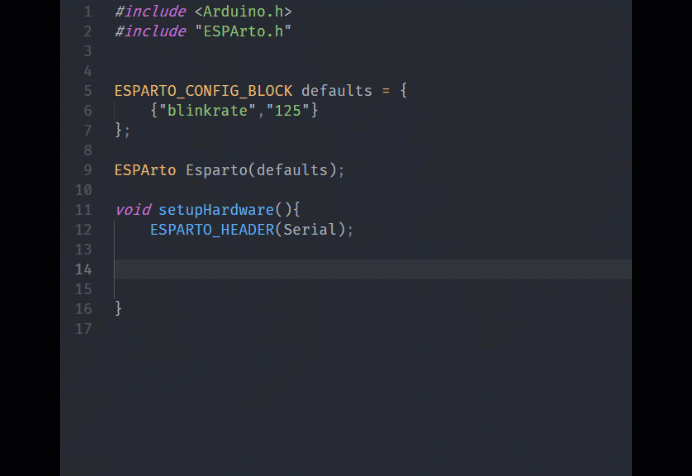

# esparto-snippets

ESPArto framework made it easier for one to program ESP8266 and get many and many of its capabilities.

And this extension Makes the life easier and coding faster with ESPArto framework.

## Features

Auto-completion code and ready-snippets to work with esparto functions and their own parameters.

Also supports esparto callback function types

## Requirements

To get the best use of this extension :
install PlatformIO extension
Add ESPArto framework : 
- By PlatformIO libraries or its own github [repository](https://github.com/philbowles/esparto)

## Release Notes

### 0.0.1

Initial release of Esparto snippets for vscode.

